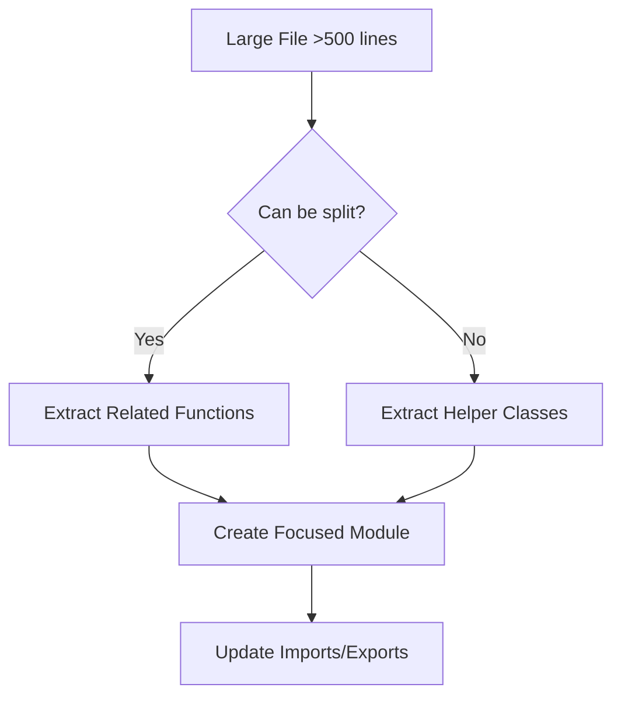

# AI Coding Best Practices for Rulette Project

- playwright for ui, jest for functions
- systems engineering
	conops
	inputs
	outputs
	verifications
- order of build backend (local with simulated data before using firestore)
- build each feature and test each feature from front to back (don't build everything local and then rebuild in cloud and don't build all in cloud from the start)
- estimating progress with story points
- code tells us how, comments tell us why
- ada rules, epilepsy prevention, and accessibility
- cyber security
- having an admin panel to quickly test everything live
- saving session/login info locally so we can refresh the page and quickly test things locally
- **Modular Architecture**: Clear separation between game logic ([`gameManager.js`](../gameManager.js)), UI ([`main.js`](../main.js)), and specialized systems ([`ruleEngine.js`](../ruleEngine.js), [`cardManager.js`](../cardManager.js))
- **Consistent Class Structure**: Well-defined classes with clear constructors and methods
- **Comprehensive Error Handling**: Extensive try-catch blocks and validation
- **Firebase Integration**: Consistent async/await patterns for database operations
- **Event-Driven Design**: Good use of event listeners and callbacks

### Areas of Concern for AI Development
- **Large Files**: [`gameManager.js`](../gameManager.js) is 7,647 lines - exceeds AI context limits
- **Complex Interdependencies**: Multiple systems interact in complex ways
- **Mixed Responsibilities**: Some functions handle both UI and business logic

## Core AI Coding Principles
### 1. File Size Management
**Rule: Keep files under 500 lines maximum**


**Implementation:**
- Split [`gameManager.js`](../gameManager.js) into focused modules:
  - `sessionManager.js` (session lifecycle)
  - `playerManager.js` (player operations)
  - `pointsManager.js` (scoring system)
  - `cardTransferManager.js` (card operations)

### 2. Function Complexity Limits
**Rule: Functions should not exceed 50 lines**

**Bad Example:**
```javascript
// 100+ line function that handles multiple concerns
async function handleComplexGameAction(sessionId, playerId, action) {
    // Validation logic (20 lines)
    // Business logic (40 lines)
    // UI updates (30 lines)
    // Error handling (20 lines)
}
```

**Good Example:**
```javascript
async function handleComplexGameAction(sessionId, playerId, action) {
    const validation = await validateGameAction(sessionId, playerId, action);
    if (!validation.isValid) return validation;
    
    const result = await executeGameAction(sessionId, playerId, action);
    await updateGameUI(sessionId, result);
    
    return result;
}
```

### 3. Clear Dependency Management
**Rule: Explicit imports and minimal coupling**

**Implementation Pattern:**
```javascript
// At top of file - clear dependencies
import { GameManager } from './gameManager.js';
import { CardManager } from './cardManager.js';
import { validateSession, validatePlayer } from './validators.js';

// Clear dependency injection
class FeatureManager {
    constructor(gameManager, cardManager) {
        this.gameManager = gameManager;
        this.cardManager = cardManager;
    }
}
```

## Testing Best Practices for AI

### 1. Test-First Development
**Rule: Write tests before implementation**

```javascript
// Example test structure
describe('PlayerManager', () => {
    let playerManager;
    let mockGameManager;
    
    beforeEach(() => {
        mockGameManager = createMockGameManager();
        playerManager = new PlayerManager(mockGameManager);
    });
    
    test('should add player to session successfully', async () => {
        const result = await playerManager.addPlayer('session1', 'player1', 'TestPlayer');
        
        expect(result.success).toBe(true);
        expect(result.player.displayName).toBe('TestPlayer');
        expect(mockGameManager.sessions['session1'].players).toContain('player1');
    });
});
```

### 2. Comprehensive Error Testing
**Rule: Test all error conditions**

```javascript
test('should handle duplicate player names gracefully', async () => {
    await playerManager.addPlayer('session1', 'player1', 'TestPlayer');
    
    const result = await playerManager.addPlayer('session1', 'player2', 'TestPlayer');
    
    expect(result.success).toBe(false);
    expect(result.error).toBe('DUPLICATE_NAME');
    expect(result.suggestedName).toBe('TestPlayer_2');
});
```

### 3. Integration Test Patterns
**Rule: Test component interactions**

```javascript
test('should handle complete card transfer workflow', async () => {
    // Setup
    const session = await createTestSession();
    const player1 = await addTestPlayer(session.id, 'player1');
    const player2 = await addTestPlayer(session.id, 'player2');
    const card = await giveCardToPlayer(player1.id, 'test-card');
    
    // Execute
    const result = await gameManager.transferCard(
        session.id, player1.id, player2.id, card.id
    );
    
    // Verify
    expect(result.success).toBe(true);
    expect(await getPlayerCards(player1.id)).not.toContain(card.id);
    expect(await getPlayerCards(player2.id)).toContain(card.id);
});
```

## Maintainability Guidelines

### 1. Consistent Naming Conventions
**Rule: Use descriptive, consistent names**

```javascript
// Good - Clear intent and consistent pattern
async function validatePlayerCanJoinSession(sessionId, playerId) { }
async function validatePlayerCanLeaveSession(sessionId, playerId) { }
async function validatePlayerCanTransferCard(sessionId, playerId, cardId) { }

// Bad - Inconsistent and unclear
async function checkPlayer(id) { }
async function playerOK(sessionId, playerId) { }
async function canTransfer(p1, p2, c) { }
```

### 2. Documentation Standards
**Rule: Document all public methods and complex logic**

```javascript
/**
 * Transfers a card from one player to another within a game session.
 * 
 * @param {string} sessionId - The game session identifier
 * @param {string} fromPlayerId - Source player's unique identifier
 * @param {string} toPlayerId - Target player's unique identifier
 * @param {string} cardId - Card identifier to transfer
 * @param {string} reason - Reason for transfer (for audit trail)
 * @returns {Promise<TransferResult>} Result object with success status and details
 * 
 * @throws {ValidationError} When session or players are invalid
 * @throws {CardNotFoundError} When card doesn't exist or isn't owned by source player
 * 
 * @example
 * const result = await transferCard('session123', 'player1', 'player2', 'card456', 'callout_penalty');
 * if (result.success) {
 *   console.log(`Card transferred successfully: ${result.transferId}`);
 * }
 */
async function transferCard(sessionId, fromPlayerId, toPlayerId, cardId, reason = 'manual') {
    // Implementation...
}
```

### 3. Error Handling Patterns
**Rule: Consistent error handling and recovery**

```javascript
// Standard error response pattern
function createErrorResponse(code, message, details = {}) {
    return {
        success: false,
        error: code,
        message: message,
        details: details,
        timestamp: Date.now()
    };
}

// Standard success response pattern
function createSuccessResponse(data, metadata = {}) {
    return {
        success: true,
        data: data,
        metadata: metadata,
        timestamp: Date.now()
    };
}

// Usage in functions
async function someGameOperation(params) {
    try {
        const validation = validateParams(params);
        if (!validation.isValid) {
            return createErrorResponse('INVALID_PARAMS', validation.message, validation.details);
        }
        
        const result = await performOperation(params);
        return createSuccessResponse(result, { operationType: 'game_action' });
        
    } catch (error) {
        console.error('[GAME_OPERATION] Unexpected error:', error);
        return createErrorResponse('INTERNAL_ERROR', 'Operation failed', { originalError: error.message });
    }
}
```

## AI-Specific Guidelines

### 1. Context Preservation
**Rule: Maintain context across file boundaries**

```javascript
// Include context comments at file boundaries
// File: playerManager.js
// Dependencies: gameManager.js (session state), cardManager.js (player cards)
// Related files: pointsManager.js, sessionManager.js
// Key interfaces: Player, Session, GameState

export class PlayerManager {
    // Clear interface documentation
}
```

### 2. Incremental Development
**Rule: Build and test incrementally**

```javascript
// Step 1: Create basic structure with tests
class NewFeatureManager {
    constructor(dependencies) {
        this.dependencies = dependencies;
    }
    
    // Placeholder method with clear interface
    async processFeature(input) {
        throw new Error('Not implemented yet');
    }
}

// Step 2: Implement core logic
// Step 3: Add error handling
// Step 4: Add edge cases
// Step 5: Optimize performance
```

### 3. Validation-First Approach
**Rule: Validate all inputs before processing**

```javascript
function validateSessionInput(sessionId, operation) {
    const errors = [];
    
    if (!sessionId || typeof sessionId !== 'string') {
        errors.push('sessionId must be a non-empty string');
    }
    
    if (!operation || typeof operation !== 'string') {
        errors.push('operation must be a non-empty string');
    }
    
    return {
        isValid: errors.length === 0,
        errors: errors
    };
}
```

## Firebase Integration Patterns

### 1. Consistent Async Patterns
**Rule: Use consistent async/await with proper error handling**

```javascript
async function updateFirestoreData(collection, docId, data) {
    try {
        const docRef = doc(db, collection, docId);
        await updateDoc(docRef, {
            ...data,
            lastUpdated: serverTimestamp()
        });
        
        return createSuccessResponse({ docId, updated: true });
        
    } catch (error) {
        console.error(`[FIRESTORE] Failed to update ${collection}/${docId}:`, error);
        return createErrorResponse('FIRESTORE_UPDATE_FAILED', error.message);
    }
}
```

### 2. Data Validation Before Firebase Operations
**Rule: Validate data structure before database operations**

```javascript
function validateFirestorePlayerData(playerData) {
    const required = ['displayName', 'sessionId', 'status'];
    const missing = required.filter(field => !playerData[field]);
    
    if (missing.length > 0) {
        return {
            isValid: false,
            errors: [`Missing required fields: ${missing.join(', ')}`]
        };
    }
    
    return { isValid: true, errors: [] };
}
```

## Performance Considerations

### 1. Efficient Data Structures
**Rule: Choose appropriate data structures for operations**

```javascript
// Use Maps for frequent lookups
class SessionManager {
    constructor() {
        this.sessions = new Map(); // O(1) lookup
        this.playerToSession = new Map(); // O(1) player->session mapping
    }
    
    getPlayerSession(playerId) {
        return this.playerToSession.get(playerId);
    }
}
```

### 2. Lazy Loading Patterns
**Rule: Load data only when needed**

```javascript
class CardManager {
    constructor() {
        this.cardCache = new Map();
    }
    
    async getCard(cardId) {
        if (this.cardCache.has(cardId)) {
            return this.cardCache.get(cardId);
        }
        
        const card = await this.loadCardFromDatabase(cardId);
        this.cardCache.set(cardId, card);
        return card;
    }
}
```

## Implementation Roadmap

### Phase 1: File Restructuring (Week 1)
1. Split [`gameManager.js`](../gameManager.js) into focused modules
2. Extract utility functions into shared modules
3. Update import/export statements
4. Verify all functionality still works

### Phase 2: Testing Infrastructure (Week 2)
1. Set up comprehensive test framework
2. Create test utilities and mocks
3. Write tests for existing critical functions
4. Establish CI/CD pipeline for automated testing

### Phase 3: Documentation and Standards (Week 3)
1. Document all public APIs
2. Create coding style guide
3. Set up linting rules
4. Create development workflow documentation

### Phase 4: Optimization and Monitoring (Week 4)
1. Implement performance monitoring
2. Add error tracking and logging
3. Optimize critical paths
4. Create maintenance procedures

## Success Metrics

- **File Size**: No files exceed 500 lines
- **Function Complexity**: No functions exceed 50 lines
- **Test Coverage**: Minimum 80% code coverage
- **Documentation**: All public methods documented
- **Error Handling**: All error paths tested
- **Performance**: Page load under 3 seconds
- **Maintainability**: New features can be added without breaking existing functionality

## Quick Reference Checklist

Before submitting any code changes, verify:

File is under 500 lines
Functions are under 50 lines
All inputs are validated
Error handling is implemented
Tests are written and passing
Documentation is updated
No existing functionality is broken
Firebase operations have proper error handling
Performance impact is considered

This plan provides a comprehensive framework for AI developers to contribute effectively to the Rulette project while maintaining code quality and preventing common pitfalls.
