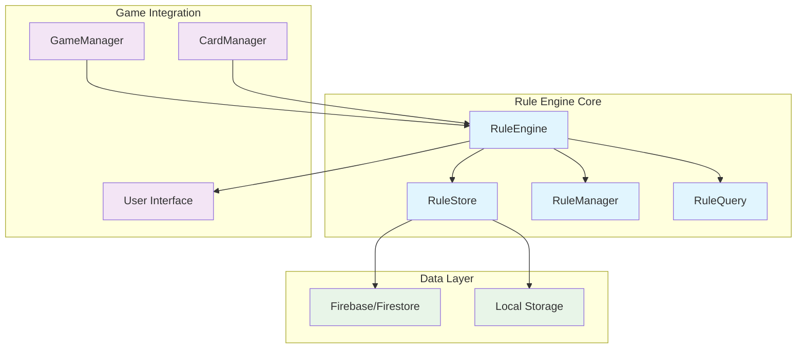
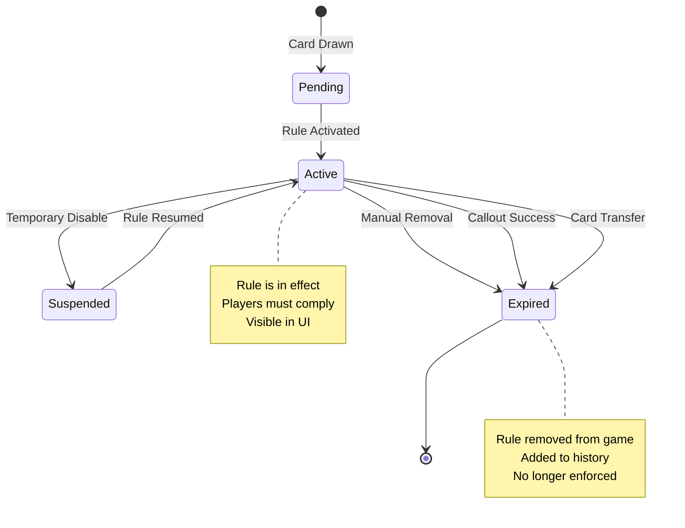
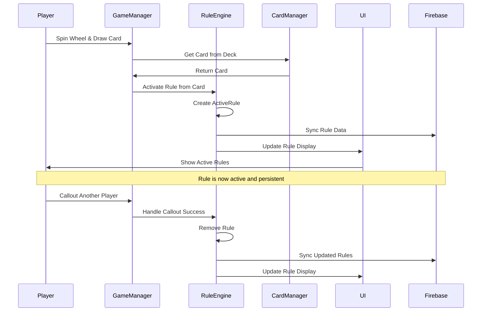

# Rulette Rule Engine Architecture and Data Structures Design

## High-Level Architecture Overview

The proposed rule engine for Rulette is designed as a centralized, lightweight system that manages active rules with minimal automatic triggering, focusing on persistence and additive rule stacking. The architecture consists of four core components:

1.  **RuleEngine**: Central coordinator managing rule lifecycle
2.  **RuleStore**: Data storage with indexed access for efficient querying
3.  **RuleManager**: Handles rule activation, deactivation, and state transitions
4.  **RuleQuery**: Provides fast lookup and filtering capabilities



## Detailed Data Structures

### ActiveRule Data Structure

```javascript
class ActiveRule {
    constructor({
        id,                    // Unique identifier
        cardId,               // Reference to source card
        ownerId,              // Player who owns this rule
        ruleText,             // Current active rule text
        ruleType,             // 'rule', 'modifier', 'prompt'
        state,                // 'active', 'suspended', 'expired'
        activatedAt,          // Timestamp when rule became active
        metadata,             // Additional rule-specific data
        removalConditions,    // Conditions for rule removal
        stackingBehavior      // How this rule interacts with others
    }) {
        this.id = id || this.generateId();
        this.cardId = cardId;
        this.ownerId = ownerId;
        this.ruleText = ruleText;
        this.ruleType = ruleType;
        this.state = state || 'active';
        this.activatedAt = activatedAt || Date.now();
        this.metadata = metadata || {};
        this.removalConditions = removalConditions || [];
        this.stackingBehavior = stackingBehavior || 'additive';
    }
}
```

### RuleStore Data Structure

```javascript
class RuleStore {
    constructor() {
        this.activeRules = new Map();        // sessionId -> Map<ruleId, ActiveRule>
        this.ruleHistory = new Map();       // sessionId -> Array<RuleHistoryEntry>
        this.rulesByPlayer = new Map();     // sessionId -> Map<playerId, Set<ruleId>>
        this.rulesByType = new Map();       // sessionId -> Map<ruleType, Set<ruleId>>
    }
}
```

### Rule State Management

```javascript
const RuleStates = {
    ACTIVE: 'active',           // Rule is currently in effect
    SUSPENDED: 'suspended',     // Rule temporarily disabled
    EXPIRED: 'expired',         // Rule has been removed/completed
    PENDING: 'pending'          // Rule waiting for activation
};

const RemovalConditions = {
    MANUAL: 'manual',           // Explicit removal by game event
    CALLOUT_SUCCESS: 'callout_success',  // Successful callout removes rule
    CARD_TRANSFER: 'card_transfer',      // Rule removed when card transferred
    FLIP_CARD: 'flip_card',             // Rule changed by flip card
    PROMPT_COMPLETION: 'prompt_completion' // Prompt rule completed
};
```

### Rule Engine Core Class

```javascript
class RuleEngine {
    constructor(gameManager) {
        this.gameManager = gameManager;
        this.ruleStore = new RuleStore();
        this.ruleManager = new RuleManager(this);
        this.ruleQuery = new RuleQuery(this);
        this.eventHandlers = new Map();
    }

    // Core rule lifecycle methods
    activateRule(sessionId, activeRule) { /* Implementation */ }
    deactivateRule(sessionId, ruleId, reason) { /* Implementation */ }
    suspendRule(sessionId, ruleId) { /* Implementation */ }
    resumeRule(sessionId, ruleId) { /* Implementation */ }
    
    // Rule querying and management
    getActiveRules(sessionId, filters = {}) { /* Implementation */ }
    getRulesForPlayer(sessionId, playerId) { /* Implementation */ }
    getRulesByType(sessionId, ruleType) { /* Implementation */ }
    
    // Integration with game events
    handleCardDrawn(sessionId, playerId, card) { /* Implementation */ }
    handleCalloutSuccess(sessionId, targetPlayerId, ruleId) { /* Implementation */ }
    handleCardTransfer(sessionId, fromPlayerId, toPlayerId, cardId) { /* Implementation */ }
}
```

## Rule Lifecycle Flow



## Rule Stacking and Interaction System

Since rules stack additively, the system will:

1.  **Maintain Rule Collections**: Each session maintains a collection of active rules
2.  **Display All Active Rules**: UI shows all rules that players must follow
3.  **No Conflict Resolution**: Rules don't cancel each other out
4.  **Cumulative Effects**: Players must satisfy all active rules simultaneously

```javascript
class RuleStackManager {
    constructor(ruleEngine) {
        this.ruleEngine = ruleEngine;
    }
    
    // Get all rules a player must follow
    getEffectiveRulesForPlayer(sessionId, playerId) {
        const activeRules = this.ruleEngine.getActiveRules(sessionId);
        const playerRules = this.ruleEngine.getRulesForPlayer(sessionId, playerId);
        
        // Combine global rules and player-specific rules
        return {
            globalRules: activeRules.filter(rule => !rule.ownerId || rule.ownerId !== playerId),
            playerRules: playerRules,
            allRules: [...activeRules, ...playerRules]
        };
    }
    
    // Check if adding a new rule would create issues
    validateRuleAddition(sessionId, newRule) {
        // Since rules stack additively, validation is minimal
        // Just check for basic constraints
        return {
            valid: true,
            warnings: [],
            conflicts: []
        };
    }
}
```

## Persistence and Synchronization

```javascript
class RulePersistence {
    constructor(ruleEngine) {
        this.ruleEngine = ruleEngine;
        this.syncInterval = 5000; // 5 seconds
    }
    
    // Sync rules to Firebase
    async syncRulesToFirestore(sessionId) {
        const activeRules = this.ruleEngine.getActiveRules(sessionId);
        const rulesData = activeRules.map(rule => rule.toFirestoreData());
        
        await updateFirestoreGameRules(sessionId, rulesData);
    }
    
    // Load rules from Firebase
    async loadRulesFromFirestore(sessionId) {
        const rulesData = await getFirestoreGameRules(sessionId);
        
        rulesData.forEach(ruleData => {
            const activeRule = ActiveRule.fromFirestoreData(ruleData);
            this.ruleEngine.ruleStore.addRule(sessionId, activeRule);
        });
    }
    
    // Handle real-time rule updates
    subscribeToRuleUpdates(sessionId, callback) {
        return subscribeToFirestoreGameRules(sessionId, (rulesData) => {
            this.handleRuleUpdates(sessionId, rulesData);
            callback(rulesData);
        });
    }
}
```

## Efficient Rule Querying

```javascript
class RuleQuery {
    constructor(ruleEngine) {
        this.ruleEngine = ruleEngine;
        this.indexCache = new Map();
    }
    
    // Fast lookups with indexed access
    getRulesByPlayer(sessionId, playerId) {
        const playerIndex = this.ruleEngine.ruleStore.rulesByPlayer.get(sessionId);
        const ruleIds = playerIndex?.get(playerId) || new Set();
        
        return Array.from(ruleIds).map(ruleId => 
            this.ruleEngine.ruleStore.activeRules.get(sessionId)?.get(ruleId)
        ).filter(Boolean);
    }
    
    getRulesByType(sessionId, ruleType) {
        const typeIndex = this.ruleEngine.ruleStore.rulesByType.get(sessionId);
        const ruleIds = typeIndex?.get(ruleType) || new Set();
        
        return Array.from(ruleIds).map(ruleId => 
            this.ruleEngine.ruleStore.activeRules.get(sessionId)?.get(ruleId)
        ).filter(Boolean);
    }
    
    // Complex queries with filtering
    queryRules(sessionId, filters = {}) {
        let rules = Array.from(
            this.ruleEngine.ruleStore.activeRules.get(sessionId)?.values() || []
        );
        
        if (filters.state) {
            rules = rules.filter(rule => rule.state === filters.state);
        }
        
        if (filters.ruleType) {
            rules = rules.filter(rule => rule.ruleType === filters.ruleType);
        }
        
        if (filters.ownerId) {
            rules = rules.filter(rule => rule.ownerId === filters.ownerId);
        }
        
        return rules;
    }
}
```

## Integration with Existing Game Systems



## Key Benefits

1.  **Simplicity**: Minimal complexity matching game's social enforcement model
2.  **Performance**: Indexed storage enables fast rule lookups
3.  **Scalability**: Efficient data structures support multiple concurrent sessions
4.  **Persistence**: Rules survive session interruptions and reconnections
5.  **Flexibility**: Extensible design accommodates future rule types and behaviors

This architecture provides a robust foundation for managing Rulette's dynamic rule system while maintaining the game's emphasis on player-driven enforcement and social interaction.