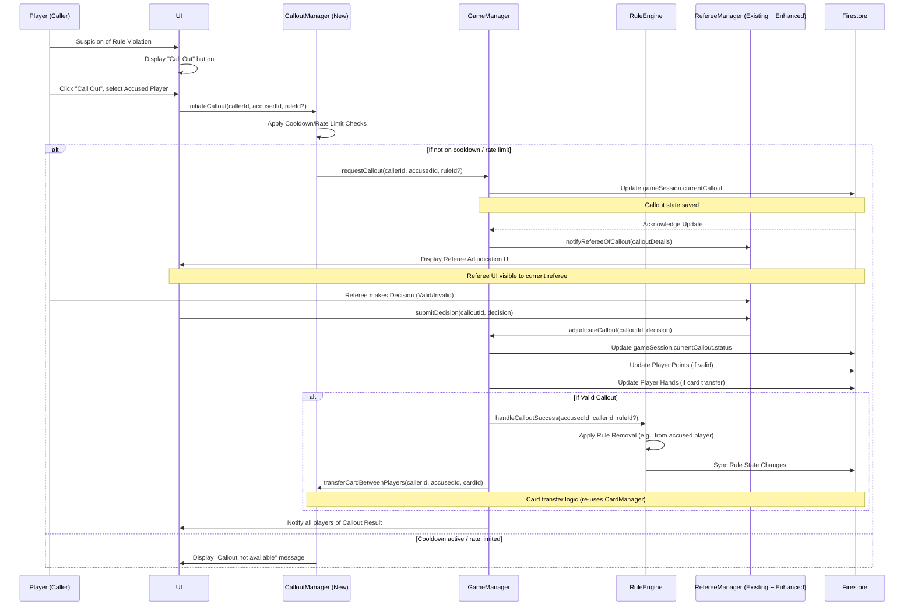

# Plan 4: Referee and Callout Mechanic

**Phase:** 2 — Core Game Mechanics  
**Story Points:** 15

---

## Objective

Implement the referee and callout system, enabling players to challenge rule violations and empowering the referee to adjudicate disputes. This plan ensures fair play, social interaction, and dynamic point/card transfer mechanics, while integrating with and extending existing game components.

---

## High-Level Architectural Design

The Referee and Callout Mechanic will primarily extend the functionality within `gameManager.js` and integrate with `ruleEngine.js` for rule validation and event handling. New UI components will be added to `index.html` (or separate UI files loaded into it) and managed by `main.js` for player interaction and referee adjudication.

### Core Components & Responsibilities:

1.  **`CalloutManager.js` (New Module):** This module will encapsulate the logic for initiating and managing callouts.
    *   **Responsibilities:**
        *   Receive callout requests from the UI (`main.js`).
        *   Validate basic callout conditions (e.g., player exists, not calling themselves out).
        *   Communicate callout details to `GameManager`.
        *   Manage debounce/cooldown for callouts to prevent spamming.
2.  **`RefereeManager.js` (Extension/Enhancement of `GameManager` and `main.js`):** The existing `GameManager` already handles referee assignment and prompt judging. This is not a new file, but an implicit extension of the logic within `GameManager` and the UI control in `main.js`.
    *   **Responsibilities:**
        *   Receive callout notifications from `CalloutManager`.
        *   Present callout details to the active referee via UI.
        *   Receive referee's decision (valid/invalid).
        *   Initiate point deductions/additions and card transfers based on the decision.
        *   Handle referee card swapping.
        *   Notify all players of callout outcomes.
3.  **`GameManager.js` (Core Game State Management):** This central module (`gameManager.js`) will coordinate the actions related to callouts and referee decisions.
    *   **Responsibilities:**
        *   Maintain game state, including player points, player hands, and current referee.
        *   Expose methods for `CalloutManager` to initiate callouts and for `RefereeManager` to apply decisions.
        *   Update player points.
        *   Facilitate `cardManager.js` for card transfers between players.
        *   Interact with `ruleEngine.js` for rule-related aspects of callouts (e.g., `handleCalloutSuccess`).
4.  **`RuleEngine.js` & `RuleManager.js` (Rule Validation & Effect Application):** The existing rule engine will be used to verify rule violations if applicable and to apply any rule-based side effects of a callout, such as removing a rule if a callout is successful.
    *   **Responsibilities:**
        *   Potentially validate if a called-out rule actually exists or was active.
        *   Handle `RemovalConditions.CALLOUT_SUCCESS` for rules.
        *   Trigger `ON_CALLOUT` events for specific rules.
5.  **`CardManager.js` (Card Manipulation):** The existing `CardManager` will be leveraged for transferring cards between players.
    *   **Responsibilities:**
        *   Provide an API for transferring specific cards from one player's hand to another.
        *   Potentially handle special transfer logic for specific card types (e.g., cloning, swapping).
6.  **UI Components (`index.html`, `main.js`):** New UI elements will be required for player-initiated callouts and referee adjudication.
    *   **Responsibilities:**
        *   Player UI: Button to initiate callout, player selection dropdown/modal.
        *   Referee UI: Notification of callout, display of caller/accused, "Valid" / "Invalid" decision buttons, context of the rule.
        *   General UI: Notifications for callout outcomes (success/failure, point changes, card transfers).

---

## Data Structures / State Variables Needed

To support the mechanic, the following data structures and state variables will likely be needed, primarily residing within `GameManager`'s game session and player objects, and communicated via Firebase.

*   **`GameSession` Object (`gameManager.js`):**
    *   `currentCallout`: An object storing details of an active callout request. This should be null if no callout is active to prevent multiple simultaneous callouts.
        ```javascript
        // Example structure for currentCallout
        {
            callerId: "playerId123",
            accusedPlayerId: "playerId456",
            timestamp: Date.now(),
            status: "pending_referee_decision", // "pending_referee_decision", "valid", "invalid"
            ruleViolated: "Optional rule ID or description", // If a specific rule was called out
            cardToTransfer: { cardId: "cardXYZ", cardObj: GameCardInstance } // If a card is pending transfer
        }
        ```
    *   `calloutHistory`: An array to log past callouts for later review or abuse prevention.
    *   `consecutiveCallouts`: Per-player counter for rapid succession callouts (abuse prevention).
    *   `lastCalloutTimestamp`: Per-player timestamp to track callout cooldown (abuse prevention).
*   **`Player` Object (`gameManager.js`):**
    *   `points`: Existing field, will be updated.
    *   `hand`: Existing field, will be updated for card transfers.
    *   `hasRefereeCard`: Existing field.
*   **Firebase / Firestore:** These new state variables for `GameSession` and `Player` objects will need to be synchronized with Firestore to ensure real-time updates across clients.
    *   `gameSessions/{sessionId}/currentCallout`
    *   `gameSessions/{sessionId}/calloutHistory`
    *   `gameSessions/{sessionId}/players/{playerId}/points`
    *   `gameSessions/{sessionId}/players/{playerId}/hand`
    *   `gameSessions/{sessionId}/players/{playerId}/calloutCooldown`

---

## Card Transfer Scenarios (4.3.3)

The card transfer logic can be centralized within `GameManager` using `CardManager`.

*   **Basic Transfer (Referee awards card transfer after a callout):**
    *   `GameManager`'s `transferCardBetweenPlayers(sessionId, fromPlayerId, toPlayerId, cardId)` method will be beefed up. This method will:
        1.  Verify `fromPlayerId` possesses `cardId`.
        2.  Remove `cardId` from `fromPlayerId`'s hand.
        3.  Add `cardId` to `toPlayerId`'s hand.
        4.  Update Firestore for both players' hands.
        5.  Emit `EventTypes.CARD_TRANSFERRED` event via `RuleEngineEventEmitter` for `RuleEngine` to handle `RemovalConditions.CARD_TRANSFER`.
*   **Special Card-Triggered Transfers (Swap, Clone, Flip, Prompt, Rule Modifier):**
    *   The `CardManager` would need a new method like `applyCardEffect(cardType, context)` or the `GameManager`'s `handleCardPlay` will coordinate these.
    *   **Swap Card Played (`4.4 Referee Card Swapping`):**
        *   `GameManager.swapRefereeRole(sessionId, currentRefereeId, newRefereeId)`: This method (already exists) will be responsible for updating the `session.referee` and `player.hasRefereeCard` properties. It will also handle the actual transfer of the "Referee Card" game object if it's treated as a physical card in a player's hand using the `transferCardBetweenPlayers` logic. It also needs to notify all players (`main.js` for UI update).
    *   **Clone or Flip Card Played:** These likely have their own existing logic. If they involve card transfers between players (e.g., giving a cloned card to someone), they should reuse the `transferCardBetweenPlayers` utility within `GameManager`.
    *   **Prompt Card Requires Transfer:** The `judgePrompt` function in `GameManager` (and its UI in `main.js`) will be extended to include an option for the referee to trigger a card transfer as part of the prompt's resolution. This would call `transferCardBetweenPlayers`.
    *   **Rule Modifier Triggers Transfer:** `RuleEngine` will have the capability to instruct `GameManager` to execute a card transfer if a rule is activated or modified in a way that requires it. This means `RuleEngine` would call `GameManager.transferCardBetweenPlayers`.

---

## Edge Cases and Abuse Prevention (4.5)

1.  **Prevent spamming of callouts or referee decisions (4.5.1):**
    *   **Callouts:**
        *   Implement a cooldown period within `CalloutManager` or `GameManager`. A player cannot initiate a new callout for X seconds after their last one, regardless of outcome. This will be stored as `lastCalloutTimestamp` per player.
        *   Rate limiting: Limit the number of callouts a player can make within a given time frame (e.g., max 3 callouts per minute). `consecutiveCallouts` counter.
        *   Server-side validation: All callout requests must be validated on the server to prevent client-side bypass of cooldowns.
    *   **Referee Decisions:**
        *   A referee can only adjudicate one active callout at a time. The `currentCallout` state will ensure this.
        *   Decision submission should be atomic and idempotent.
        *   Server-side validation: Ensure only the true referee can submit a decision for the current callout.
2.  **Handle scenarios: Referee is accused or caller (4.5.2):**
    *   **Referee is the Caller:** This is allowed. The current referee could call out another player.
    *   **Referee is the Accused:**
        *   For explicit player-initiated callouts, it's simpler to disallow the referee as the accused to avoid complex adjudication logic. If the game design allows the referee to be accused, the `GameManager` would need a special `adjudicateRefereeCallout` method (e.g., prompting all *other* players to vote, or self-adjudication by the game system if tied to a verifiable rule violation). For this plan, we will aim to prevent players from calling out the active referee directly via UI controls. If a rule card specifically targets the referee, the system enforces it directly.
3.  **Multiple callouts in rapid succession:** Covered by cooldowns and rate limiting.
4.  **Players attempting to bypass referee decisions:**
    *   All critical state changes (points, card transfers, referee status) must be server-authoritative (Firebase writes). Client-side UI is merely a display/input mechanism.
    *   Client-side validation should exist for a good UX, but server-side validation is paramount.
    *   Logging: Maintain detailed logs of all callouts and referee decisions in Firebase to enable audit trails and identify malicious behavior if needed.

---

## Interaction Flow Diagram



---

## Tasks (from 1-requirements.md)

### 4.1 Callout Mechanism (4 Points)
[ ] 4.1.1 Allow players to call out others for failing to follow a rule (2 Points) - *Will be implemented via `CalloutManager.js` and UI in `main.js`*
[ ] 4.1.2 Provide UI for initiating a callout and selecting the accused player (2 Points) - *Will be implemented in `index.html` and `main.js`*

### 4.2 Referee Adjudication (4 Points)
[ ] 4.2.1 Notify the referee of a callout and present context of who called out who (2 Points) - *`GameManager` to `RefereeManager` (logic in `main.js`), UI in `index.html` and `main.js`*
[ ] 4.2.2 Allow the referee to decide if the callout is valid or not (2 Points) - *Logic in `GameManager` (adjudicateCallout) and UI in `index.html` and `main.js`*

### 4.3 Point and Card Transfer Logic (3 Points)
[ ] 4.3.1 If the callout is valid, deduct a point from the failed player and add a point to the caller (2 Points) - *Logic in `GameManager`*
[ ] 4.3.2 Allow the caller to transfer one of their cards to the failed player (1 Point) - *Logic in `GameManager` (`transferCardBetweenPlayers`) and UI in `main.js` (for card selection)*
[ ] 4.3.3 Card transfer scenarios include: - *Will be handled by extending `GameManager`'s card transfer logic and `RuleEngine` interaction*
    - Referee awards card transfer after a callout
    - Swap card is played (roles or cards exchanged)
    - Clone or flip card is played (card duplicated or reversed)
    - Prompt card requires a transfer as part of its effect
    - Rule modifier triggers a transfer

### 4.4 Referee Card Swapping (2 Points)
[ ] 4.4.1 Enable the referee card to be swapped if a swap card is played (1 Point) - *Existing `GameManager.swapRefereeRole` will be used and enhanced.*
[ ] 4.4.2 Update referee status and notify all players (1 Point) - *Handled by `GameManager` and UI in `main.js`*

### 4.5 Edge Cases and Abuse Prevention (2 Points)
[ ] 4.5.1 Prevent spamming of callouts or referee decisions (1 Point) - *Cooldowns and rate limiting in `CalloutManager` and `GameManager`*
[ ] 4.5.2 Handle the following scenarios: - *Logic in `GameManager` and UI in `main.js` to restrict calls*
    - Referee is the accused or caller
    - Multiple callouts in rapid succession
    - Players attempting to bypass referee decisions

---

## Acceptance Criteria

- Players can call out others for rule violations.
- Referee receives and adjudicates callouts.
- Points and cards are transferred correctly on valid callouts.
- Referee card can be swapped and status updates accordingly.
- Abuse and edge cases are handled gracefully.

---

## Dependencies

- Previous plans for `gameManager.js`, `cardManager.js`, `ruleEngine.js` must be stable.

---

## Out of Scope

- UI/UX polish beyond functional callout and referee screens.
- Complex rule parsing for automated referee decisions (referee still decides manually).
